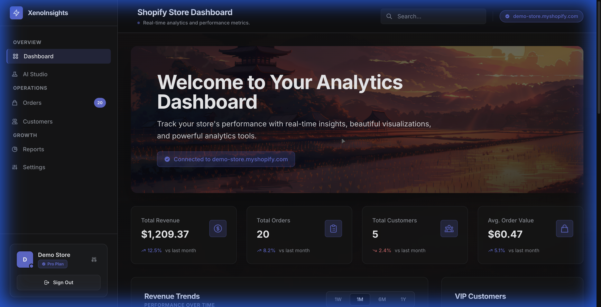

# Shopify Analytics Dashboard

A modern, full-stack analytics platform for Shopify stores, featuring real-time sales visualization, AI-driven data insights, and a premium UI.



## Overview

This application provides Shopify merchants with a powerful, intuitive dashboard to track their store's performance. Built with Ruby on Rails 7 and a custom Shadcn-inspired design system, it offers a seamless user experience with instant data processing and actionable insights.

## Key Features

*   **Real-time Analytics**: Interactive charts and graphs for revenue, orders, and customer growth.
*   **AI Insights**: Natural language query interface powered by LLMs to ask questions about your data (e.g., "Who are my top customers?").
*   **Multi-Tenant Architecture**: Secure data isolation for multiple shops.
*   **Background Processing**: Asynchronous job handling for reliable webhook processing and data syncing.
*   **Modern UI/UX**: Responsive, dark-mode-first design with smooth animations and glassmorphism effects.

## Tech Stack

*   **Backend**: Ruby on Rails 7.0, PostgreSQL, Sidekiq
*   **Frontend**: Tailwind CSS, Stimulus.js, Chartkick
*   **Infrastructure**: Docker, Render (Deployment)
*   **AI Integration**: Groq API / Llama 3

## Getting Started

### Prerequisites

*   Ruby 3.2.2
*   PostgreSQL
*   Redis

### Installation

1.  Clone the repository:
    ```bash
    git clone https://github.com/kbss0000/shopify-analytics.git
    cd shopify-analytics
    ```

2.  Install dependencies:
    ```bash
    bundle install
    ```

3.  Setup database:
    ```bash
    rails db:setup
    ```

4.  Start the server:
    ```bash
    ./bin/dev
    ```

## License

This project is licensed under the MIT License - see the [LICENSE](LICENSE) file for details.
