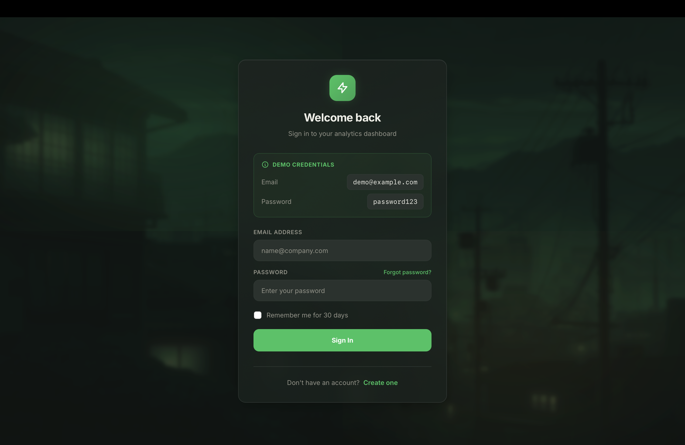
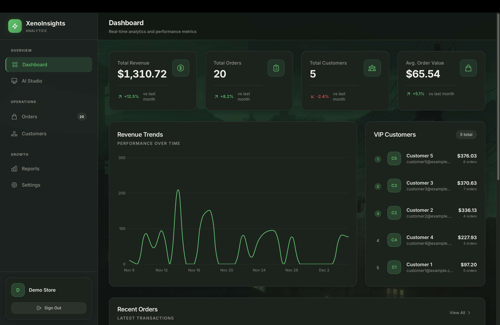
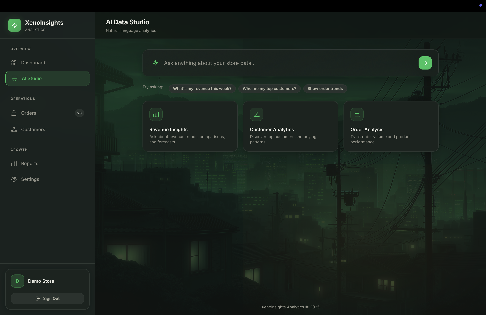
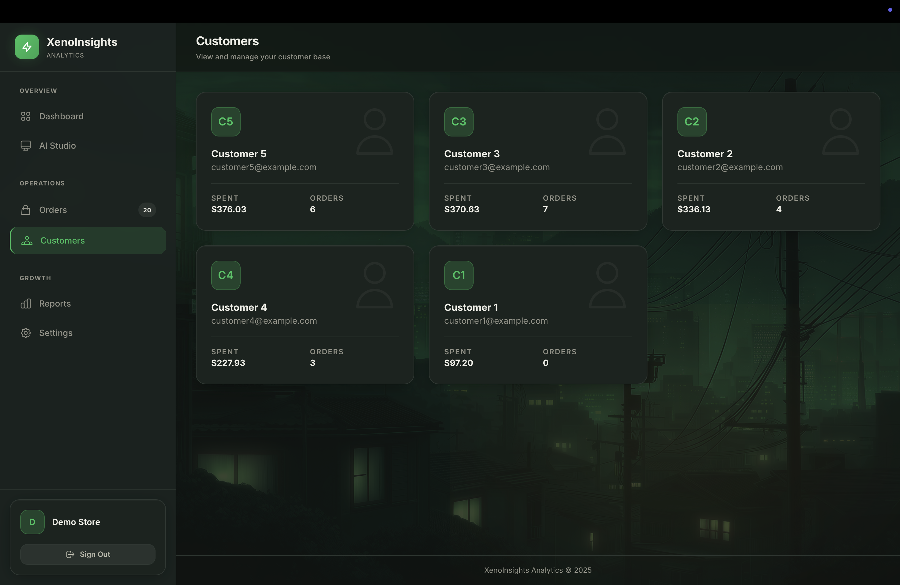
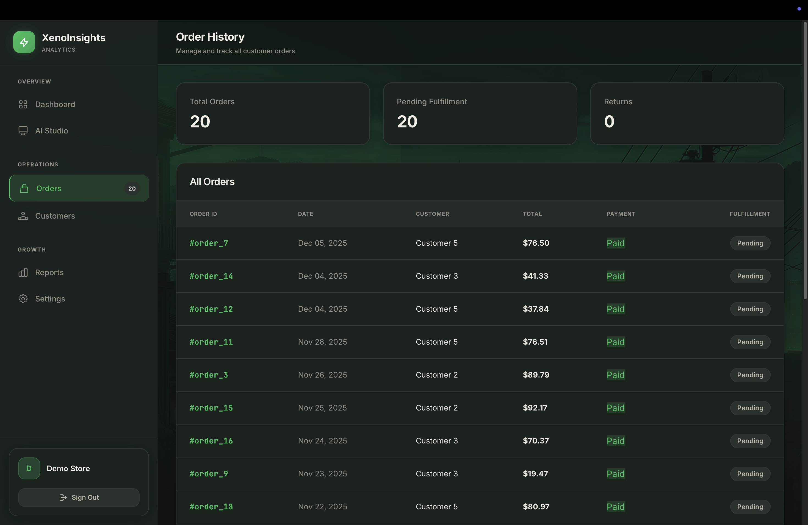
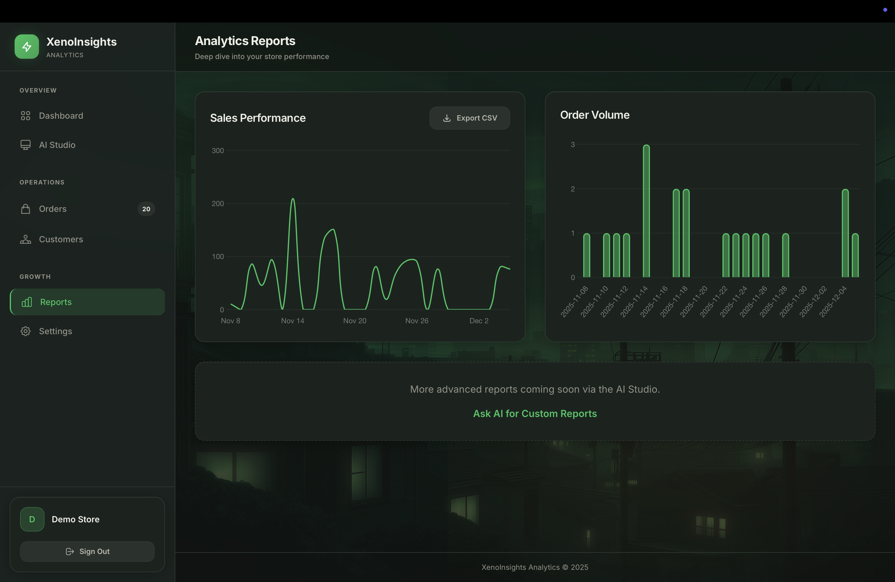

# XenoInsights - AI-Powered Shopify Analytics Dashboard

A full-stack analytics platform for Shopify stores with AI-powered insights, revenue tracking, customer analytics, and natural language querying. Built with Ruby on Rails and featuring a premium dark-themed UI with the Osaka Jade design system.

**Live Demo:** https://shopify-analytics-le8r.onrender.com

**Login Credentials:** `demo@example.com` / `password123`

---

## 🎬 Live Demo Video


https://github.com/user-attachments/assets/6aeca734-ec4b-4ffa-b068-1a18d26b1351


---

## Table of Contents

- [Features](#features)
- [Tech Stack](#tech-stack)
- [Project Structure](#project-structure)
- [Setup Instructions](#setup-instructions)
- [API Documentation](#api-documentation)
- [Screenshots](#screenshots)
- [Design Decisions](#design-decisions)
- [Environment Variables](#environment-variables)
- [License](#license)

---

## Features

### Core Features

- **Revenue Analytics**: Real-time revenue tracking with interactive Chart.js visualizations
- **Order Management**: Track orders with status badges, customer info, and order details
- **Customer Insights**: View top customers by spend, order history, and customer metrics
- **Dashboard Stats**: At-a-glance KPIs including total revenue, orders, customers, and average order value
- **Reports**: Comprehensive reporting with order status breakdowns and conversion metrics

### AI Features (Powered by Groq)

- **Natural Language Queries**: Ask questions like "What are my top 5 customers?" and get instant answers
- **SQL Generation**: AI translates natural language to safe, tenant-scoped SQL queries
- **Data Insights**: Get AI-powered analysis of your store's performance
- **Smart Suggestions**: Pre-built query suggestions for common analytics needs

### Authentication & Security

- **Multi-tenant Architecture**: Complete data isolation between stores
- **Devise Authentication**: Secure JWT-based authentication system
- **SQL Injection Prevention**: AI-generated queries are sanitized and restricted to SELECT statements
- **Tenant Scoping**: All queries automatically filtered by tenant_id

---

## Tech Stack

### Backend

| Technology | Purpose |
|------------|---------|
| Ruby on Rails 7 | Web Framework |
| PostgreSQL | Production Database |
| Redis | Caching & Sidekiq |
| Sidekiq | Background Jobs |
| Devise | Authentication |
| Groupdate | Date Grouping for Charts |
| Money-Rails | Currency Handling |

### Frontend

| Technology | Purpose |
|------------|---------|
| Tailwind CSS | Styling Framework |
| Hotwire (Turbo + Stimulus) | SPA-like Experience |
| Chart.js 4 | Data Visualization |
| Chartkick | Rails Chart Helpers |

### AI & APIs

| Technology | Purpose |
|------------|---------|
| Groq API | LLM for Natural Language Processing |
| Llama 3.3 70B | AI Model for Query Generation |

### Deployment

| Service | Purpose |
|---------|---------|
| Render | Web Service & Database |
| Docker | Local Development |
| GitHub | Version Control |

---

## Project Structure

```
shopify-analytics/
├── app/
│   ├── controllers/
│   │   ├── ai_controller.rb        # AI query processing
│   │   ├── dashboard_controller.rb # Main dashboard
│   │   ├── customers_controller.rb # Customer management
│   │   ├── orders_controller.rb    # Order management
│   │   └── reports_controller.rb   # Analytics reports
│   ├── javascript/
│   │   ├── controllers/            # Stimulus controllers
│   │   └── application.js          # Main JS entry
│   ├── models/
│   │   ├── tenant.rb               # Multi-tenant model
│   │   ├── customer.rb             # Customer model
│   │   ├── order.rb                # Order model
│   │   └── product.rb              # Product model
│   ├── services/
│   │   └── analytics_service.rb    # Analytics logic
│   └── views/
│       ├── ai/                     # AI Studio views
│       ├── dashboard/              # Dashboard partials
│       ├── layouts/                # Application layout
│       └── shared/                 # Shared components
├── config/
│   ├── database.yml                # Database config
│   ├── importmap.rb                # JS imports
│   └── tailwind.config.js          # Tailwind theme
├── db/
│   ├── migrate/                    # Database migrations
│   └── seeds.rb                    # Demo data
├── bin/
│   └── render-build.sh             # Render deployment script
├── render.yaml                     # Render service config
├── Dockerfile                      # Docker configuration
└── README.md
```

---

## Setup Instructions

### Prerequisites

- Docker & Docker Compose
- Git

### Local Development with Docker

#### 1. Clone the Repository

```bash
git clone https://github.com/kbss0000/shopify-analytics.git
cd shopify-analytics
```

#### 2. Environment Setup

```bash
# Copy environment template
cp .env.example .env

# Add your Groq API key (optional - for AI features)
echo "GROQ_API_KEY=your_groq_api_key" >> .env
```

#### 3. Start the Application

```bash
# Build and start containers
bin/dev

# Or manually with docker-compose
docker-compose up --build
```

The application will be available at `http://localhost:3000`

#### 4. Access the Application

Open http://localhost:3000 in your browser and login with:

- **Email:** demo@example.com
- **Password:** password123

---

## API Documentation

### Authentication Endpoints

| Method | Endpoint | Description |
|--------|----------|-------------|
| GET | `/tenants/sign_in` | Login page |
| POST | `/tenants/sign_in` | Authenticate user |
| DELETE | `/tenants/sign_out` | Logout |

### Dashboard Endpoints

| Method | Endpoint | Description |
|--------|----------|-------------|
| GET | `/dashboard` | Main analytics dashboard |
| GET | `/dashboard?start_date=&end_date=` | Filtered dashboard |

### Resource Endpoints

| Method | Endpoint | Description |
|--------|----------|-------------|
| GET | `/customers` | List all customers |
| GET | `/orders` | List all orders |
| GET | `/reports` | Analytics reports |
| GET | `/settings` | Account settings |

### AI Endpoints

| Method | Endpoint | Description |
|--------|----------|-------------|
| GET | `/ai` | AI Studio interface |
| POST | `/ai/ask` | Submit natural language query |

---

## Screenshots

### Login Page
Secure authentication with Osaka Jade themed dark UI and glassmorphism effects.



### Dashboard
Analytics overview with revenue chart, stat cards, top customers, and recent orders.



### AI Studio
Natural language query interface powered by Groq API with smart suggestions.



### Customers
Customer management with total spent tracking and order history.



### Orders
Order management with status badges and customer details.



### Reports
Comprehensive analytics with order status breakdown and conversion metrics.



---

## Screenshot File Names

Place your screenshots in a `screenshots/` folder with these names:

| Screenshot | Filename | Description |
|------------|----------|-------------|
| Login Page | `login.png` | The sign-in page with demo credentials |
| Dashboard | `dashboard.png` | Main dashboard with charts and stats |
| AI Studio | `ai-studio.png` | AI query interface with suggestions |
| Customers | `customers.png` | Customer list with spending info |
| Orders | `orders.png` | Orders table with status badges |
| Reports | `reports.png` | Reports page with analytics |

---

## Design Decisions

### Architecture

- **Multi-tenant SaaS**: Each store (tenant) has completely isolated data
- **Service Objects**: Business logic extracted into `AnalyticsService` for testability
- **Stimulus Controllers**: JavaScript functionality encapsulated in controllers
- **Importmaps**: Native ES modules without bundler complexity

### UI/UX

- **Osaka Jade Theme**: Custom dark theme with jade green (#22c55e) accents
- **Glassmorphism**: Frosted glass effects for cards and overlays
- **Premium Feel**: Careful attention to shadows, gradients, and micro-interactions
- **Responsive**: Works on desktop and tablet devices

### Security

- **SQL Injection Prevention**: AI-generated queries restricted to SELECT statements
- **Tenant Isolation**: All database queries scoped by tenant_id
- **Safe Query Execution**: Dangerous keywords (DROP, DELETE, UPDATE) blocked

### Data Model

- **Tenant**: Store accounts with Devise authentication
- **Customer**: Customer profiles with total spent tracking
- **Order**: Orders with status, line items, and totals
- **Product**: Product catalog with pricing

---

## Environment Variables

### Required for Production

| Variable | Description | Required |
|----------|-------------|----------|
| `RAILS_MASTER_KEY` | Decrypts credentials.yml.enc | Yes |
| `DATABASE_URL` | PostgreSQL connection string | Yes (Render provides) |
| `SECRET_KEY_BASE` | Session encryption key | Yes (Render generates) |

### Optional

| Variable | Description | Required |
|----------|-------------|----------|
| `GROQ_API_KEY` | Groq API key for AI features | No (falls back to simulated) |
| `REDIS_URL` | Redis connection for Sidekiq | No |

---

## Running Tests

```bash
# Run Rails tests
docker-compose exec web bundle exec rails test

# Run RSpec (if configured)
docker-compose exec web bundle exec rspec
```

---

## Deployment

The application is configured for Render deployment:

1. Push to GitHub
2. Connect repository to Render
3. Set `RAILS_MASTER_KEY` in Render dashboard
4. Optionally set `GROQ_API_KEY` for AI features
5. Deploy

---

## License

MIT License - See LICENSE file for details.

---

## Author

Kasilanka Bhoopesh Siva Srikar

---

## About

A full-stack Shopify analytics dashboard with AI-powered natural language querying. Features a premium dark UI with the Osaka Jade design system, real-time charts, and comprehensive store analytics.

https://shopify-analytics-le8r.onrender.com


