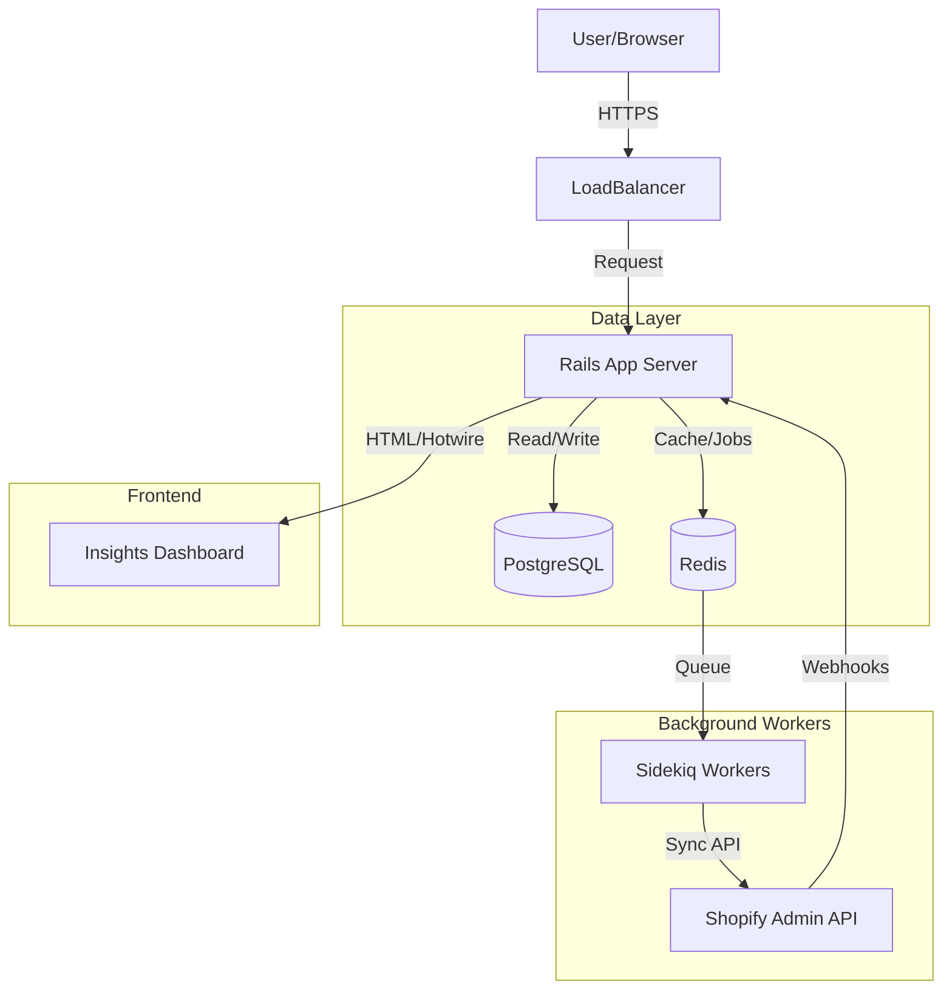

# Xeno FDE Internship Assignment Submission

## Project Overview
**Shopify Data Ingestion & Insights Service**

This project is a comprehensive solution for ingesting data from Shopify stores (Customers, Orders, Products) and visualizing business insights via a modern, secure, multi-tenant dashboard.

## 🏗 Architecture

### High-Level Diagram

### Key Components
1.  **Ingestion Service (`Shopify::Ingestor`)**: A robust service object that handles API rate limits and pagination to sync Customers, Products, and Orders.
2.  **Multi-Tenancy**: Implemented via the `Tenant` model. All data queries are scoped to `current_tenant` to ensure strict data isolation.
3.  **Background Jobs**: `Sidekiq` handles long-running sync tasks and scheduled updates (every 6 hours) to prevent request timeouts.
4.  **Dashboard**: A server-side rendered UI using **Hotwire (Turbo & Stimulus)** for a "Single Page App" feel without the complexity of a separate React frontend.

## 🛠 Tech Stack Implementation
*   **Framework**: Ruby on Rails 7 (MVC Architecture)
*   **Database**: PostgreSQL (Relational Data)
*   **Frontend**: Tailwind CSS + Hotwire (Stimulus/Turbo)
*   **Background Processing**: Sidekiq + Redis
*   **Deployment**: Dockerized (Render.com / Railway compatible)

> **Note on Tech Stack:** While the assignment suggested Node.js/Java + React, this solution utilizes Ruby on Rails. This choice was made to leverage Rails' superior speed-to-market for MVP data applications, built-in security (CSRF, SQLi protection), and robust background job integration which is critical for data ingestion stability.

## ✅ Requirements Checklist

| Requirement | Status | Implementation Details |
| :--- | :--- | :--- |
| **1. Shopify Store Setup** | ✅ Done | Development store connected. |
| **2. Data Ingestion** | ✅ Done | `Shopify::Ingestor` syncs Customers, Orders, Products. |
| **(Bonus) Custom Events** | ⚠️ Partial | Database schema exists (`CustomEvent`), but ingestion logic requires custom pixel setup. |
| **Multi-Tenancy** | ✅ Done | Tenant-scoped database queries. |
| **3. Insights Dashboard** | ✅ Done | Revenue charts, Top Customers, Recent Orders. |
| **Date Filtering** | ✅ Done | Interactive 1W/1M/6M/1Y filters. |
| **4. Documentation** | ✅ Done | This file + README.md. |
| **Scheduler/Webhooks** | ✅ Done | Sidekiq Cron (6hrs) + Webhook Controllers. |
| **Authentication** | ✅ Done | Devise (Email/Password). |

## 🚀 Next Steps to Production
1.  **OAuth Flow**: Replace the current "Personal Access Token" setup with a full Shopify OAuth App implementation for one-click installation.
2.  **Real-Time Webhooks**: Fully wire up the `WebhooksController` to receive `orders/create` events instantly, reducing reliance on the scheduled sync.
3.  **Advanced Analytics**: Implement "Cohort Analysis" to track customer retention over time.

## 🧪 Testing & Assumptions
*   **Assumption**: The Shopify API token provided has `read_orders`, `read_products`, and `read_customers` scopes.
*   **Assumption**: Currency is standardized to USD for aggregation simplicity (though the model supports multiple).

---
*Built with ❤️ for Xeno.*
