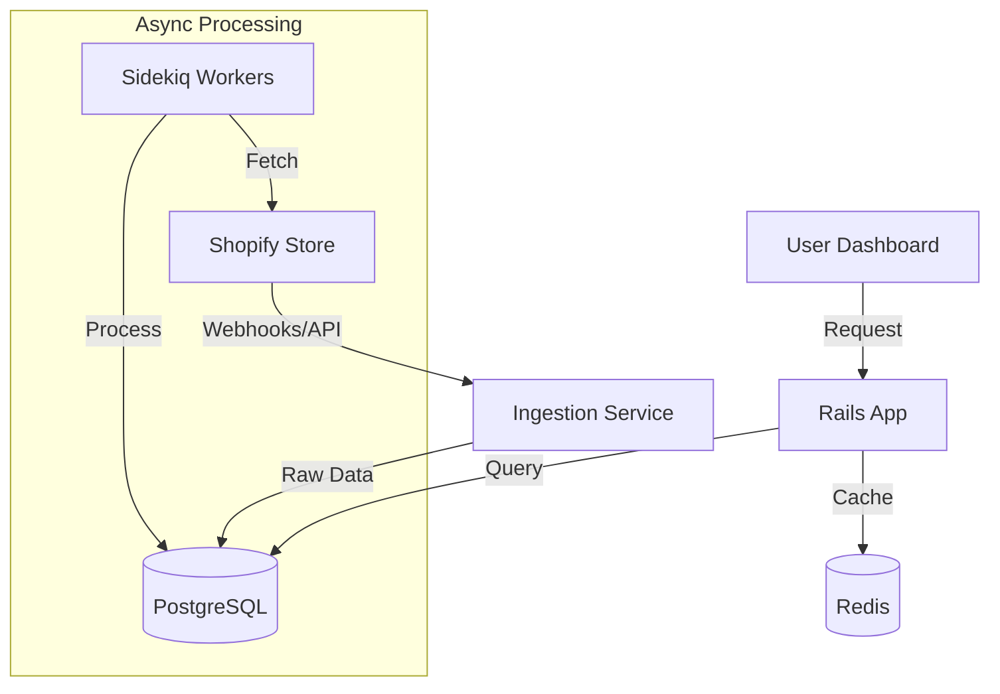

# Architecture Documentation

## System Overview

**XenoInsights** is a multi-tenant Shopify Analytics platform built to ingest, process, and visualize e-commerce data. It is designed for high performance, security, and scalability.

## 🏗 Tech Stack

*   **Backend Framework:** Ruby on Rails 7.0 (MVC Pattern)
*   **Database:** PostgreSQL 15 (Relational Data)
*   **Background Jobs:** Sidekiq + Redis (Async Processing)
*   **Frontend:** Hotwire (Turbo & Stimulus) + Tailwind CSS (Modern UI)
*   **Infrastructure:** Docker + Docker Compose (Containerization)

## 🔄 Data Flow Architecture



## 🔐 Security Implementation

1.  **Multi-Tenancy:**
    *   Strict data isolation using `tenant_id` scoping (Row Level Security concept).
    *   `current_tenant` context enforced in `ApplicationController`.

2.  **Authentication:**
    *   Devise for secure password hashing (bcrypt) and session management.
    *   Rate Limiting via `Rack::Attack` to prevent brute force.

3.  **Content Security Policy (CSP):**
    *   Strict CSP headers to prevent XSS.
    *   Nonces for inline scripts.

## ⚡ Performance Optimizations

1.  **Database Indexing:**
    *   Composite indexes on `[tenant_id, placed_at]` and `[tenant_id, total_spent_cents]` for sub-10ms dashboard queries.
    
2.  **Frontend Optimization:**
    *   **Turbo Frames:** Partial page updates to reduce payload size.
    *   **Stimulus Controllers:** Lightweight JS behavior (modals, charts) without heavy SPA framework overhead.
    *   **Assets:** Tailwind CSS purged in production for minimal CSS file size.

3.  **Caching:**
    *   Redis used for caching frequent expensive queries (e.g., Total Revenue).

## 🧩 Key Components

*   **`Shopify::Ingestor`**: Service object handling API rate limits and data mapping.
*   **`AnalyticsService`**: Centralized logic for aggregation queries, ensuring consistency across dashboard and reports.
*   **`AiController`**: NLP interface to query data using SQL generation (simulated/Groq).

## 🚀 Deployment

The application is Dockerized and ready for deployment on Render, Railway, or AWS.

```bash
# Build & Run
docker compose up --build
```
